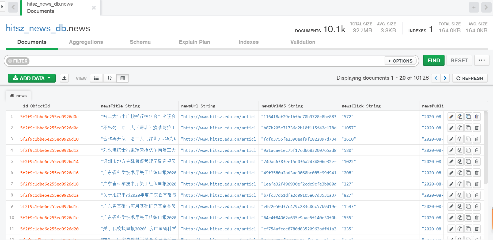
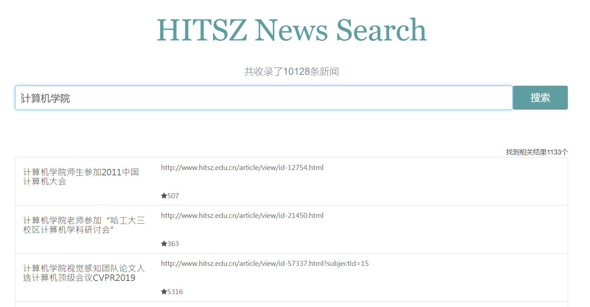

### 一、爬虫

使用Python的scrapy库进行爬虫

#### 1.1 爬取内容

爬虫爬取以 http://www.hitsz.edu.cn/article/view/ 开头的所有新闻页面的内容，爬取的内容包括：

| Item     | Item name       |
| -------- | --------------- |
| 标题     | newsTitle       |
| 链接     | newsUrl         |
| 阅读量   | newsClick       |
| 发布时间 | newsPublishTime |
| 文章内容 | newsContent     |

```python
# hitsz_news_spider.py
# 爬取当前网页
print('start parse : ' + response.url)
self.destination_list.remove(response.url)
if response.url.startswith("http://www.hitsz.edu.cn/article/view/"):
    item = NewsItem()
    for box in response.xpath('//div[@class="container_news"]/div[@class="mainwidth"]/div[@class="leftside_news"]/div[@class="detail_out"]'):
        # article title
        item['newsTitle'] = box.xpath('.//div[@class="title"]/text()').extract()[0].strip()

        # article url
        item['newsUrl'] = response.url
        item['newsUrlMd5'] = self.md5(response.url)

        # article click time
        item['newsClick'] = box.xpath('.//div[@class="tip"]/span[@class="item view"]/text()').extract()[0].strip()
        
        # article publish time
        item['newsPublishTime'] = box.xpath('.//div[@class="tip"]/span[@class="item"]/text()').extract()[0].strip()[5:]
        
        # article content
        item['newsContent'] = box.xpath('.//div[@class="detail"]/div[@class="edittext"]').extract()[0].strip()
        regexp = re.compile(r'<[^>]+>', re.S)
        item['newsContent'] = regexp.sub('',item['newsContent'])    # delete templates <>
        
        # 索引构建flag
        item['indexed'] = 'False'
        
        # yield it
        yield item
```

#### 1.2 广度优先搜索爬取

爬虫基于广度优先搜索，从网页http://www.hitsz.edu.cn/article/index.html开始，爬取新闻内容的同时，爬取网页上所有的网址，用广度优先搜索爬取到的所有网址，将http://www.hitsz.edu.cn/article/view/开头的网页上的新闻内容提取出来。

```python
# settings.py
# 先进先出，广度优先
DEPTH_PRIORITY = 1
SCHEDULER_DISK_QUEUE = 'scrapy.squeue.PickleFifoDiskQueue'
SCHEDULER_MEMORY_QUEUE = 'scrapy.squeue.FifoMemoryQueue'
```

#### 1.3 二分法去重

所有已经爬取过的网址都会以MD5特征的形式顺序存储在list中，当获取新的url时，通过二分法查找list中是否存在该url的特征值，以达到去重的目的。

Scrapy库自带了查重去重的功能，但为了保证效率，自行编写了二分法去重，但并未关闭scrapy库自带的去重功能。

```python
# hitsz_news_spider.py
# md5 check
md5_url = self.md5(real_url)
if self.binary_md5_url_search(md5_url) > -1:    # 二分法查找存在当前MD5
    pass
else:
    self.binary_md5_url_insert(md5_url) # 二分法插入当前MD5
    self.destination_list.append(real_url)  # 插入爬虫等待序列
    yield scrapy.Request(real_url, callback=self.parse, errback=self.errback_httpbin)
```

#### 1.4 断点续爬

每爬取一定次数后都会将当前爬虫状态存储在pause文件夹下，重新运行爬虫时会继续上一次保存的断点进行爬取。

```python
# hitsz_news_spider.py
# counter++，并在合适的时候保存断点
def counter_plus(self):
    print('待爬取网址数：' + (str)(len(self.destination_list)))
    # 断点续爬功能之保存断点
    if self.counter % self.save_frequency == 0:  # 爬虫经过save_frequency次爬取后
        print('Rayiooo：正在保存爬虫断点....')

        f = open('./pause/response.seen', 'wb')
        pickle.dump(self.url_md5_seen, f)
        f.close()

        f = open('./pause/response.dest', 'wb')
        pickle.dump(self.destination_list, f)
        f.close()

        self.counter = self.save_frequency

    self.counter += 1  # 计数器+1
```

#### 1.5 数据存入MongoDB

关系类数据库不适用于爬虫数据存储，因此使用非关系类数据库MongoDB。数据库用可视化工具MongoDB Compass查看。

```python
# pipelines.py
class MongoDBPipeline(object):
    def __init__(self):
        host = settings["MONGODB_HOST"]
        port = settings["MONGODB_PORT"]
        dbname = settings["MONGODB_DBNAME"]
        sheetname = settings["MONGODB_SHEETNAME"]
        # 创建MONGODB数据库链接
        client = pymongo.MongoClient(host=host, port=port)
        # 指定数据库
        mydb = client[dbname]
        # 存放数据的数据库表名
        self.post = mydb[sheetname]

    def process_item(self, item, spider):
        data = dict(item)
        # self.post.insert(data)    # 直接插入的方式有可能导致数据重复
        # 更新数据库中的数据，如果upsert为Ture，那么当没有找到指定的数据时就直接插入，反之不执行插入
        self.post.update({'newsUrlMd5': item['newsUrlMd5']}, data, upsert=True)
        return item
```




### 二、搜索引擎

#### 2.1 断点续构

构建倒排索引的过程比较缓慢，每小时只能构建10000条新闻的索引，因此在索引构建时及时存储新构建的索引，以保证能够断点续构。

```python
self.pagesCollection.update_one({'_id': row['_id']}, {'$set': {'indexed': 'True'}})
writer.commit()     # 每次构建提交一次
writer = ix.writer()    # 然后重新打开
indexed_amount += 1
```

#### 2.2 中文分词

Whoosh自带的Analyzer分词仅针对英文文章，而不适用于中文。从jieba库中引用的ChineseAnalyzer保证了能够对Documents进行中文分词。同样，ChineseAnalyzer在search时也能够对中文查询query提取关键字并进行搜索。

```python
# index_builder.py
from jieba.analyse import ChineseAnalyzer

analyzer = ChineseAnalyzer()
# 创建索引模板
schema = Schema(
    newsId=ID(stored=True),
    newsTitle=TEXT(stored=True, analyzer=analyzer),
    newsUrl=ID(stored=True),
    newsClick=NUMERIC(stored=True, sortable=True),
    newsPublishTime=TEXT(stored=True),
    newsContent=TEXT(stored=False, analyzer=analyzer),  # 文章内容太长了，不存
)
```

#### 2.3 Query类提供搜索API

Query类自动执行了从index索引文件夹中取倒排索引来执行搜索，并返回一个结果数组。

```python
# query.py
if __name__ == '__main__':
    q = Query()
    q.standard_search('软件园校区')
```


### 三、前端

#### Django搭建Web界面

Django适合Web快速开发。result页面继承了main页面，搜索结果可以按照result中的指示显示在页面中。在django模板继承下，改变main.html中的页面布局，result.html的布局也会相应改变而不必使用Ctrl+c、Ctrl+v的方式改变。

```python
# view.py
def search(request):
    res = None
    if 'q' in request.GET and request.GET['q']:
        res = q.standard_search(request.GET['q'])   # 获取搜索结果
        c = {
            'query': request.GET['q'],
            'resAmount': len(res),
            'results': res,
        }
    else:
        return render_to_response('main.html')

    return render_to_response('result.html', c) # 展示搜索结果
```



### 四、搜索引擎评估

#### precision@5

##### quary 1：计算机学院

precision：5/5 = 1

响应时间：136ms

##### quary 2：出国交流

precision：5/5 = 1

响应时间：87ms

##### quary 3：国家奖学金

precision：5/5 = 1

响应时间：29ms

##### quary 4：转专业政策

precision：4/5 = 0.8

响应时间：23ms

##### quary 5：食堂招标

precision：5/5 = 1

响应时间：12ms

##### quary 6：重点实验室

precision：5/5 = 1

响应时间：80ms

##### quary 6：鹏程实验室

precision：5/5 = 1

响应时间：36ms

##### quary 7：数学建模

precision：5/5 = 1

响应时间：19ms

##### quary 8：经济管理学院

precision：5/5 = 1

响应时间：106ms

##### quary 9：英语讲座

precision：5/5 = 1

响应时间：23ms

##### quary 10：运动会

precision：5/5 = 1

响应时间：19ms


10个quary的precision@5的平均为1，响应时间全部小于200ms，搜索出的结果越多，响应时间越长。

第一次搜索时，可能因为倒排索引index的取出时间较长而搜索缓慢，但一旦index取出，搜索将非常迅速。


### 五、代码运行

* 运行`hitszspider/run.py`来进行网络爬虫，这个过程将持续很长时间，但可以随时终止，在下次运行时继续。

* 运行`indexbuilder/index_builder.py`来对数据库中的数据构建索引，这个过程将持续很长时间，但可以随时终止。

* 运行`indexbuilder/query.py`来测试搜索功能。

* 运行`searchengine/run_server.py`打开搜索网页服务器，在浏览器中打开[127.0.0.1:8000](127.0.0.1:8000)进入搜索页面执行搜索。